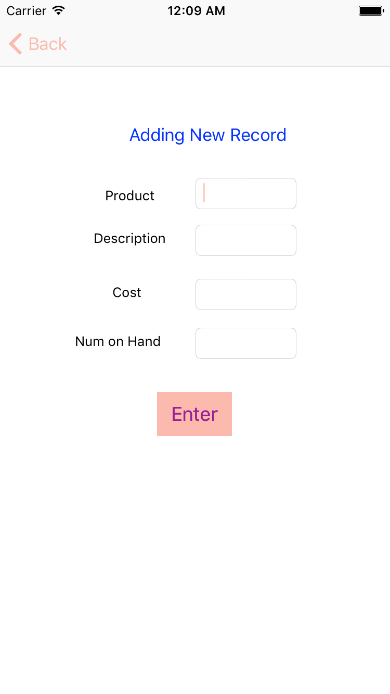
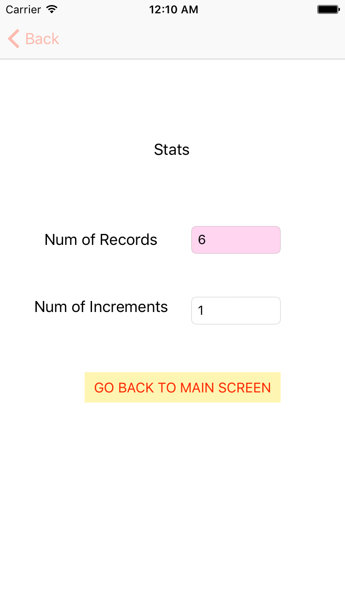

#iOS Sandy's E Store

##Overview

Simple iOS app which displays the product's image, description, price and number of stocks in Sandy's Electronic Store.
User can also create new record, and view the statistics of the page.


##Data Model
First draft schema:

```objective-c

    [Object_Info Add_Item:[Object_Info objectInfoWithProduct: @"iPhone6"
                                             withDescription:@"Apple's iPhone 6 minus plug"
                                             withCost:769.00
                                     withNum_One_Hand:0
                                     withImage: @"iphone6.png"]];
    
    
    [Object_Info Add_Item:[Object_Info objectInfoWithProduct: @"GalaxyNote7"
                                             withDescription:@"Samsung's Exploding Phone"
                                                    withCost:850.00
                                            withNum_One_Hand:0
                                                   withImage:@"galaxy7.png"]];
    
    [Object_Info Add_Item:[Object_Info objectInfoWithProduct: @"TV"
                                             withDescription:@"Sony's LED TV"
                                                    withCost:298.00
                                            withNum_One_Hand:0
                                                   withImage:@"sony.png"]];
    
    [Object_Info Add_Item:[Object_Info objectInfoWithProduct: @"KindleReader"
                                             withDescription:@"Amazon's E-Reader"
                                                    withCost:79.99
                                            withNum_One_Hand:0
                                                   withImage:@"kindle.png"]];
    
    [Object_Info Add_Item:[Object_Info objectInfoWithProduct: @"AppleWatch"
                                             withDescription:@"Series 2 - Aluminum Case"
                                                    withCost:299.00
                                            withNum_One_Hand:0
                                                   withImage:@"iwatch.png"]];

```
##User Story
1. Launch Main Screen
2. Press Forward or Backward Button in order to access products
3. Also can use slider to view the items
4. Click "Add Record" to navigate to page that adds new item
5. Click Stats Button to navigate statstics page.

## Wireframes





